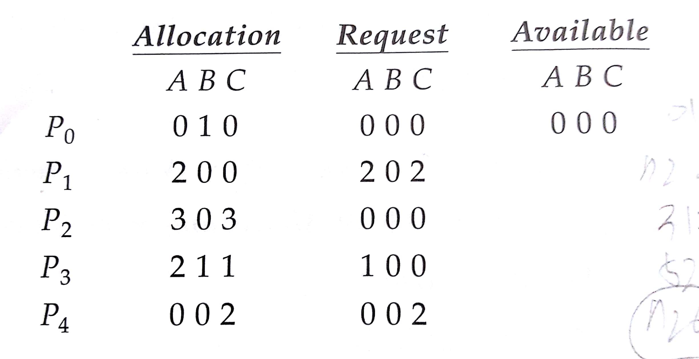

Chapter 7. 교착상태(Deadlocks)
=============
다중프로그래밍 환경에서 대기중인 프로세스들이 결코 다시는 그 상태를 변경시킬 수 없으면 이런 상황을 **교착상태** 라고 부른다.
## 7.1 시스템 모델(System Model)
1. **요청** : 프로세스는 자원을 요청한다. 요청이 즉시 허용되지 않으면, 요청 프로세스는 자원을 얻을 때까지 대기해야 한다.
2. **사용** : 프로세스는 자원에 대해 작업을 수행할 수 있다.
3. **방출** : 프로세스가 자원을 방출한다.

## 7.2 교착상태의 특징(Deadlock Characterization)
교착상태에서는 프로세스들은 결코 실행을 끝낼 수 없으며, 시스템 자원이 묶여 있어서 다른 작업을 시작하는 것도 불가능하다.

### 7.2.1. 필요 조건들(Necessary Conditions)
교착상태는 한 시스템에 다음 네 가지 조건이 동시에 성립될 때 발생할 수 있다.
1. **상호 배제(Mutual exclusion)** : 최소한 하나의 자원이 비공유 모드로 점유되어야 한다.
2. **점유하며 대기(Hold-and-wait)** : 프로세스는 최소한 하나의 자원을 점유한 채, 현재 다른 프로세스에 의해 
점유된 자원을 추가로 얻기 위해 반드시 대기해야한다.
3. **비선점(No preemption)** : 자원들은 선점할 수 없어야 한다. 즉, 자원이 강제적으로 방출 될 수 없고,
점유하고 있는 프로세스가 태스크를 종료한 후 그 프로세스에 의해서만 자발적으로 방출될 수 있다.
4. **순환 대기(Circular wait)** : 대기하고 있는 프로세스의 집합에서 P0는 P1이 점유한 자원을 위해 대기하고 P1은
P2가 점유한 자원을 위해 대기하고 ...Pn-1은 Pn이 점유하고 있는 자원을 위해 대기한다.

### 7.2.2. 자원할당 그래프(Resource-Allocation Graph)
자원할당 그래프에서 프로세스Pi로부터 자원Rj로의 방향간선은 Pi → Rj 로 표현하고 이것은 프로세스가 자원의 인스턴스 하나를
요청하는 것으로 현재 이 자원을 기다리는 상태이다. 이것을 **요청간선 (Request Edge)** 라 부른다.

만약 자원타입 Rj에서 프로세스Pi로부터의 방향간선은 Rj → P1로 표현하고 이것은 Rj의 인스턴스가 
프로세스 Pi에 할당된 것을 의미한다. 이것을 **할당간선(Assignment Edge)** 라 부른다.
* 자원할당 그래프 구조
 
 
   
* 프로세스 상태
    * 프로세스 P1은 자원타입 R2의 인스턴스를 한개 점유하고 자원타입 R1의 인스턴스 한개를 기다리며 대기한다.
    * 프로세스 P2는 R1과 R2의 인스턴스를 각각 한 개씩 점유하고, 자원타입 R3의 인스턴스를 한개 기다린다.
    * 프로세스 P3는 R3의 인스턴스 한 개를 점유하고 있다.

### 교창상태를 갖는 자원 할당 그래프

 
   
위 자원 할당 그래프를 보면 두개의 사이클이 존재한다.
* P1 → R1 → P2 → R2 → P3 → R2 → P1
* P2 → R3 → P3 → R2 → P2
프로세스 P2는 프로세스 P3이 점유하고 있는 자원 R3를 기다리고 프로세스 P3는 프로세스 P1,P2가 자원 R2를 
방출하기를 기다리고 P1은 P2가 자원 R1을 방출하기를 기다리고 있다.

### 사이클이 있으면서 교착상태가 아닌 자원 할당 그래프

 
   
사이클이 있다고 해서 교착상태가 항상 존재하는것은 아니다.

* P1 → R1 → P3 → R2 → P1
프로세스 P4가 자원 타입 R2의 인스턴스를 방출 할 수 있다. 이어 그 자원이 P3에 할당될수 있고
그 경우 사이클이 없어진다.

## 7.3. 교착상태 처리 방법(Methods for Handling Deadlocks)
원칙적으로 교착상태 문제를 처리하는데는 다음과 같은 세가지 방법이 있다.
1. 시스템이 결코 교착상태가 되지 않도록 보장하기 위하여 교착상태를 예방하거나 회피하는 프로토콜을 사용한다.
2. 시스템이 교착상태가 되도록 허용한 다음에 회복시키는 방법이 있다.
3. 문제를 무시하고, 교착상태가 시스템에서 결코 발생하지 않는 척 한다.

* **교착상태 예방(Prevention)** : 교착상태를 예방하기 위해서는 교착상태 필요조건 4가지중 한가지만 깨트리면 된다.
* **교착상태 회피(Avoidence)** : 프로세스가 필요한 자원에 대한 정보를 이용하여 각 프로세스의 미래의 요청과 방출을 고려하여 회피한다.

만약 시스템이 교착상태 예방 혹은 교착상태 회피 알고리즘을 사용하지않으면, 교착상태가 발생할 수 있는데
이 때는 시스템이 교착상태를 조사하는 알고리즘과 교착상태로부터 복구 하기 위한 알고리즘을 제공할 수 있다.

## 7.4. 교착상태 예방(Deadlock Prevention)
교착상태가 발생하려면 필요한 4가지 조건중 최소한 하나가 성립하지 않도록 보장함으로써
교창상태 발생을 예방할 수 있다.

### 7.4.1. 상호배제(Mutual Exclusion)
상호 배제 조건은 적어도 하나의 자원은 공유가 불가능한 자원이여야 한다는 것이다.
공유 가능한 자원의 예는 **읽기 전용 파일(Read Only File)** 가 있다.
만일 여러 프로세스가 일기 전용의 파일을 열면 그들은 그 파일에 동시 접근을 허용한다.
프로세스는 공유 가능한 자원을 위해 대기할 필요가 없다. 
하지만 **MUTEX 락** 같은 경우는 여러 프로세스들이 공유할 수 없다.

### 7.4.2. 점유하며 대기(Hold and Wait)
프로세스가 점유하며 대기할 조건을 만족시키지 않으려면 프로세스가 실행되기 전에 자신의 모든 자원을 요청하고 할당 받을것을 
보장하면 된다. 또는 프로세스가 자원을 전혀 갖고 있지 않을 때만 자원을 요청 할 수 있도록 허용해도 된다.

* 단점
    * 많은 자원들이 할당된 후 오랜 동안 사용되지 않기 때문에 자원의 이용도가 낮다.
    * 기아상태가 가능하다 자주 쓰이는 자원들은 여러 프로세스가 계속 할당되어 있기 때문에 무한정 대기해야 할 수도 있다.

### 7.4.3. 비선점(No Preemption)
세번째 조건 이미 할당된 자원이 선점되지 않아야 한다는 것이다. 따라서 만일 어떤 자원을 
점유하고 있는 프로세스가 즉시 할당할 수 없는 다른 자원을 요청하면 모든 자원들이 선점된다.

### 7.4.4. 순환대기(Circular Wait)
교착상태가 일어나기 위한 마지막 조건은 순환대기 조건이다. 순환 대기 조건이 성립되지 않도록 하는 방법은 모든 자원 타입들에게
전체적인 순서를 부여하여, 각 프로세스가 열거된 순서대로 자원을 요청하도록 요구하는 것이다.

예를 들어 테이프 드라이브 < 디스크 드라이브 < 프린터 순서로 되어 있다고 가정하자

만약 동시에 테이프 드라이브와 프린터를 요청하는 프로세스가 있다면 
반드시 테이프 드라이브를 먼저 요청하고 다음에 프린터를 요청해야한다.

대안으로는 만약 프로세스가 프린터를 요청한다면 모든 테이프 드라이브 자원을 방출하도록 
요구하는 방법또한 있다.

## 7.5 교착상태 회피(Deadlock Avoidance)
교착상태 예방 알고리즘은 시스템 처리율(Throughput)이 감소된다는 것이다. 따라서 교착상태를 회피하는 다른 대안은 자원이 어떻게
요청될 지에 대한 추가 정보를 제공하도록 요구하는 것이다. 

### 7.5.1. 안전 상태(Safe State)
시스템 상태가 **안전(Safe)** 하다는 말은 시스템이 어떤 순서로든 프로세스들이 요청하는 모든 자원을
교착상태를 야기시키지 않고 차례로 모두 할당해 줄 수 있다는 것을 뜻한다. 즉 시스템이 **안전순서(Safe Sequence)** 를 찾을수 있다면
시스템은 안전하다고 말한다. 하지만 시스템이 불안전하다고 해서 반드시 교착상태인것은 아니다.

### 안전, 불안전, 그리고 교착상태

 
   
### 7.5.2. 자원 할당 그래프 알고리즘(Resource-Allocation Graph Algorithm)
교착상태 회피를 위해 자원 할당 그래프의 변형을 사용할 수 있다.

**예약 간선(Claim Edge)** 라는 새로운 타입의 간선을 도입한다. 예약간선 Pi → Rj는 Pi가 
미래에 자원 Rj를 요청할 것이라는 의미이다. 예약간선은 점선으로 표시한다.

 
 
만약 위 그림에서 P2가 R2를 요청한다고 가정하자.

R2가 현재는 자유 상태이지만 이를 P2에 할당할 수 없다. 왜냐하면 할당할 경우 그래프에 사이클이 생기기 때문이다.
그래프에 사이클이 생기는 것은 시스템이 교착상태가 될수 있는 가능성을 내포하게 된다.

 
 
동일한 이유로 만일 P1이 R2를 요청하고 P2가 R1을 요청해도 교착상태가 발생한다.

### 7.5.3. 은행원 알고리즘(Banker's Algorithm)
자원 할당 그래프 알고리즘은 종류마다 자원이 여러 개씩 있게 되면 사용할 수가 없다.
따라서 다소 효율성은 떨어지지만 자원이 여려개 있어도 사용할 수 있는 **은행원 알고리즘** 을 소개한다.

은행원 알고리즘을 구현하려면 몇가지의 자료구조가 필요하다. n은 프로세스의 수이고 m이 자료의 종류수라고 하자.

* Available : 각 종류 별로 가용한 자원의 개수를 나타내는 벡터로 크기는 m이다.
    * Available[j] = k 라면 현재 Rj를 k개 사용할 수 있다는 뜻이다.
* Max : 각 프로세스가 최대로 필요로 하는 자원의 개수를 나타내느 행렬로 크기가 n x m 이다. 
Max[i,j] = k 라면 Pi가 Rj를 최대 k개까지 요청할 수 있음을 뜻한다.
* Allocation : 각 프로세스에게 현재 나가있는 자원의 개수를 나타내느 행렬로 크기가 n x m 이다.
Allocation[i,j] = k 라면 현재 Pi가 Rj를 k개 사용 중 임을 뜻한다.
* Need : 각 프로세스가 향후 요청할 수 있는 자원의 개수를 나타내는 행렬로 크기가 n x m 이다.
Need[i,j] = k라면 Pi가 향후 Rj를 k개까지 더 요청할 수 있음을 뜻한다.

Need[i,j] = Max[i,j] - Allocation[i,j] 관계가 있음을 알 수 있다.

#### 7.5.3.1. 안전성 알고리즘(Safety Algorithm)
1. Work와 Finish는 각각 크기가 m과 n인 벡터이다. Work = Available로 초기값을 주고 Finish[i] = false로 초기값을 준다.
2. 아래 두 조건을 만족시키는 i 값을 찾는다.
    * Finish[i] == false
    * Need[i] <= Work(Available)
    * 만일 그러한 i 값을 찾을 수 없다면 4로 간다.
3. 할당된 자원 반납
    * Work(Available) = Work(Available) + Allocation[i]
    * Finish[i] = true
    * Step 2로간다.
4. 모든 i 값에 대해 Finish[i] == true 이면 이 시스템은 안전 상태에 잇다.

#### 7.5.3.2. 자원 요청 알고리즘(Resource-Request Algorithm)
Request[i]는 프로세스 Pi의 요청벡터 라고 하자. Request[i][j] == k 라면 Pi가 Rj를 k개까지 요청하고 있음을 뜻한다.
Pi가 자원을 요청하게 되면 아래와 같은 조치가 취해진다.
1. 만일 Request[i] <= Need[i]이면 Step2로 가고 그게 아니라면 시스템에 있는 개수보다 더 많이 요청했으므로 오류로 처리한다.
2. 만일 Request[i] <= Available 이면 step3로 가고 그게 아니라면 요청한 자원은 당장에 없으므로 Pi는 기다려야한다.
3. 마치 시스템이 Pi에게 자원을 할당해준 것처럼 시스템 상태정보를 아래처럼 바꾸어 본다.
    * Available = Available - Request[i]
    * Allocation = Allocation[i] + Request[i]
    * Need[i] = Need[i] - Request[i]

만일 이렇게 바뀐 상태가 안전하다면 Pi에게 여기에 반영된 정보대로 자원을 할당해 준다.
만일 그 상태가 불안전하다면 위의 자원 할당 상태는 원상태로 복원된다.

#### 7.5.3.3. 예시(An Illustrative Example)
만일 5개의 프로세스와 A 자원이 10개, B 자원이 5개, C 자원이 7개가 있다고 가정하자.

 
 
Need 행렬의 값은 Max - Allocation으로 부터 얻어진다.

 

이 시스템은 <P1, P3, P4, P2, P0 > Sequence에 의해 안전하다.

만약 P1이 A자원 1개와 C 자원 2개를 추가로 요청한다고 가정해보자 

즉 Request[1] = (1,0,2) 이다. 이 때 Request[1] <= Availble 인지 여부를 검새햐아한다.

즉 (1,0,2) <= (3,3,2) 이므로 마치 이 요청을 들어주는 것처럼 상태 정보를 만들어 본다.

 
 
이 경우 <P1,P3,P4,P0,P2>가 안전성 조건을 만족 시킴을 알 수 있다. 따라서 P1의 요청을 즉시 들어줄수 있다.

만약 이 상태에서 P4가 (3,3,0)을 요청한다면 자원이 모자라므로 들어 줄수 없고

P0가 (0,2,0)을 요청한다면 자원은 충분히 있지만 상태를 불안전 상태로 만드므로 그 요청 역시 즉시 들어줄 수 없다.

## 7.6. 교착상태 탐지(Deadlock Detection)
만일 시스템이 교착상태 예방이나 교착상태 방지 알고리즘을 사용하지 않는다면, 다음 알고리즘들을 반드시 지원해야한다.
* 교착상태가 발생했는지 결정하기 위해 시스템의 상태를 검사하는 알고리즘
* 교착상태로부터 회복하는 알고리즘

### 7.6.1. 각 자원 타입이 한개씩 있는경우
모든 자원들이 한개의 인스턴스만 있다면, **대기 그래프(wait-for graph)** 를 통해 교착상태를 탐지할 수 있다.

 
 
* 대기 그래프에서 Pi → Pj 간선의 의미는 Pj가 가지고 있는 자원들에 대해 프로세스 Pi가 그 자원이 필요하여 방출하기를 기다리는 의미이다.
* 따라서 자원 할당 그래프에서 Pi → Rq , Rq → Pj가 있는 경우 대기 그래프에서 Pi → Pj를 그릴수 있다.

만약 대기 그래프가 사이클을 포함하는 경우 **교착상태** 가 존재한다.

### 7.6.2. 각 타입의 자원을 여러개 가진경우
은행원 알고리즘과 마찬가지로 비슷한 자료구조를 사용한다.
* Available : 각 종류의 자원이 현재 몇개 사용 가능한지 크기가 m인 벡터이다.
* Allocation : 각 프로세스에게 현재 할당되어 있는 자원의 개수를 나타내는 행렬로 n x m 크기이다.
* Request : 각 프로세스가 현재 요청 중인 자원의 개수를 나타내는 행렬로 크기가 n x m 이다.

Request[i,j] == k 라면 현재 Pi가 Rj를 k개 요청 중임을 뜻한다.

1. Work와 Finish는 크기가 각각 m과 n인 vector이다. Work = Available로 초기화 하고 Allocation[i]가 0 이면  Finish[i] = true
0이 아니면 Finish[i] = false 이다.
2. 아래 두 조건을 만족시키는 i 값을 찾는다.
    * Finish[i] == false
    * Request[i] <= Work(Available)
    * 그러한 i값을 찾을 수 없다면 step4로 간다. 
3. 할당된 자원 반납
    * Work = Work + Allocation[i]
    * Finish[i] = true
    * go to step2
4. 어떠한 i값에 대해 (0 <= i <= n) Finish[i] == false 이면 이 시스템은 교착상태에 빠져 있는것이다. 그리고 Pi가 교착상태에 빠져잇다.

### Example

 
 
 이 시스템은 교착상태에 처해있지 않음을 알 수 있다. <P0, P2, P3, P1, P4> 순서에 따라 모든 I에 대해서 Finish[i] 가 True가 되기 때문이다.
 그렇지만 P2가 C자원을 한개 더 요청하면 Request 행렬은 아래처럼 된다.
 
 
 
 이제는 시스템이 교착상태에 빠지게 된다. P0의 자원을 회수한다고 하더라도 다른 프로세스들이 요구하는 자원을
 충족시켜줄 방법이 없기 때문이다.
 
 ### 7.6.3. 탐지 알고리즘 사용(Detection-Algorithm Usage)
 위에서 설명한 탐지 알고리즘은 언제 돌리는가?
 1. 교착상태가 얼마나 자주 일어나는가?
 2. 교착상태가 일어나면 통상 몇 개의 프로세스가 거기에 연루되는가?
 
* 교착상태가 자주 일어난다면 탐지 알고리즘도 자주 돌려야 한다.
* 프로세스의 요청이 즉시 만족되지 않을 때마다 탐지 알고리즘을 돌린다.

## 7.7. 교착상태로부터 회복(Recovery from Deadlock)
### 7.7.1. 프로세스 종료(Process Termination)
 * 교착상태 프로세스를 모두 중지 : 이 경우 부분 계산의 결과들이 전부 없어져 비용이 큰것을 볼 수 있다.
 * 교착상태가 제거 될 때까지 한 프로세스씩 중지 : 이 경우 각 프로세스가 중지 될때마다 교착상태 탐지 알고리즘을 호출하여 상당한 오버헤드를 유발한다.
 
프로세스를 중지시킬 경우 어느 프로세스를 선택할지는 많은 요인들이 있다.
1. 프로세스 우선순위가 무엇인가?
2. 지금까지 프로세스가 수행된 시간과 일을 종료하는데 더 필요한 시간
3. 프로세스가 사용한 자원 타입과 수
4. 프로세스가 종료하기 위해 더 필요한 자원의 수
5. 얼마나 많은 수의 프로세스가 종료되어야 하는가
6. 프로세스가 대화형(interactive)인지 일괄처리(batch)인지 여부

### 7.7.2. 자원선점(Resource Preemption)
자원 선점을 이용해 교착상태를 제거하려면, 교착상태가 깨어질 때까지 프로세스로부터 자원을 계속적으로 선점해 이들을 다른 프로세스에게 주어야한다.
1. 희생자 선택(Selection of victim): 어느 자원과 어느 프로세스들이 선점될 것인가? 선택 기준으로는 프로세스가 점유하고 있는 자원의수 그리고 
교착상태 프로세스가 지금까지 실행하는데 소요한 시간 등이 있다.
2. 후퇴(Rollback) : 프로세스로 부터 자원을 뺏으면 그 프로세스는 중지 시키고 재시작 하던가 교착상태를 깨드릴 수 있을 정도로만 후퇴시킬 수 있다.
후자의 경우 시스템이 실행하는 모든 프로세스들의 상태를 저장해야하므로 많은 유지비가 필요하다.
3. 기아 상태(Starvation) : 희생자 선택에 따라 자신의 작업을 결코 완료 하지 못하는 기아상태에 빠지는 프로세스가 존재할 가능성이 높다.
 
